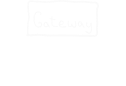

# Creating a microservice app with Shuttle

... well, how to guard access with JWTs

---
<!-- header:  -->
<!-- footer:  -->

## About me
- Pieter Engelbrecht
- But known as **chesedo** on online forums
- Tech lead at **Shuttle**

---

## Layout
Interactive tutorial
Interleave theory
Ask questions at any time

https://github.com/chesedo/rust-nation

---

- Gateway
  - /order -> Order service
  - /user -> User service

---

<!-- Not sending it in request params -->

## What is a JWT anyway?
Is used for authorization
JSON Web Token is made up of 3 parts:
1. Header
2. Payload
3. Signature (base64(header) . base64(payload))

---

### Header
<pre class="header">
{
  "alg": "HS256",
  "typ": "JWT"
}
</pre>

### Payload
<!-- Should never contain sensitive information -->
<pre class="payload">
{
  "sub": "1234567890",
  "name": "John Doe",
  "iat": 1516239022
}
</pre>

### Signature
eyJhbGciOiJIUzI1NiIsInR5cCI6IkpXVCJ9.eyJzdWIiOiIxMjM0NTY3ODkwIiwibmFtZSI6IkpvaG4gRG9lIiwiaWF0IjoxNTE2MjM5MDIyfQ => XbPfbIHMI6arZ3Y922BhjWgQzWXcXNrz0ogtVhfEd2o

---

## Payload fields

<!-- 
Why short expiry
Keep the payload compact still
 -->

- Registered (RFC 7519)
  - iss = Issuer
  - sub = Subject
  - aud = Audience
  - exp = Expiration Time
  - nbf = Not Before
  - iat = Issued At
  - jti = JWT ID

- Public
- Private

---

- Gateway
  - /order -> Order service
  - /user -> User service

---

## Best practices
Keep the payload compact
Short expiry
Don't have sensitive information in the payload
Don't send the token in the request params
Not ideal for session management

---
<!-- header: '' -->
<!-- footer: '' -->

# Questions?

https://github.com/chesedo/rust-nation